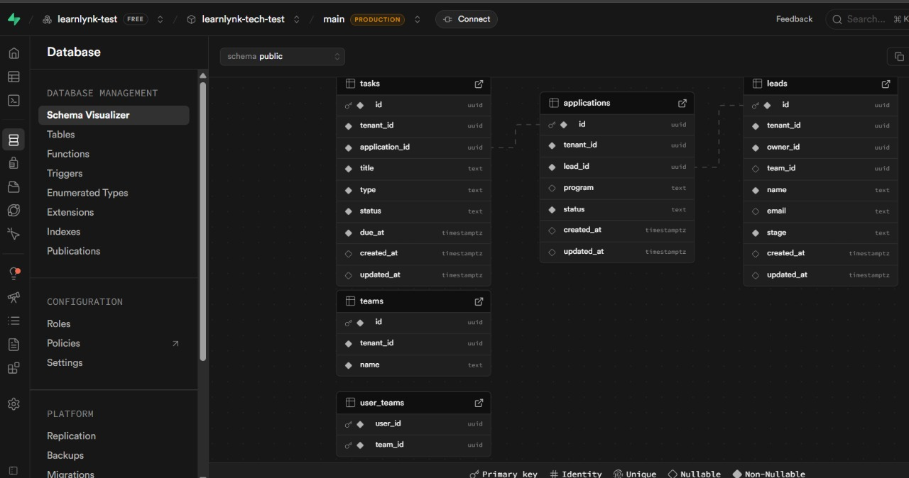
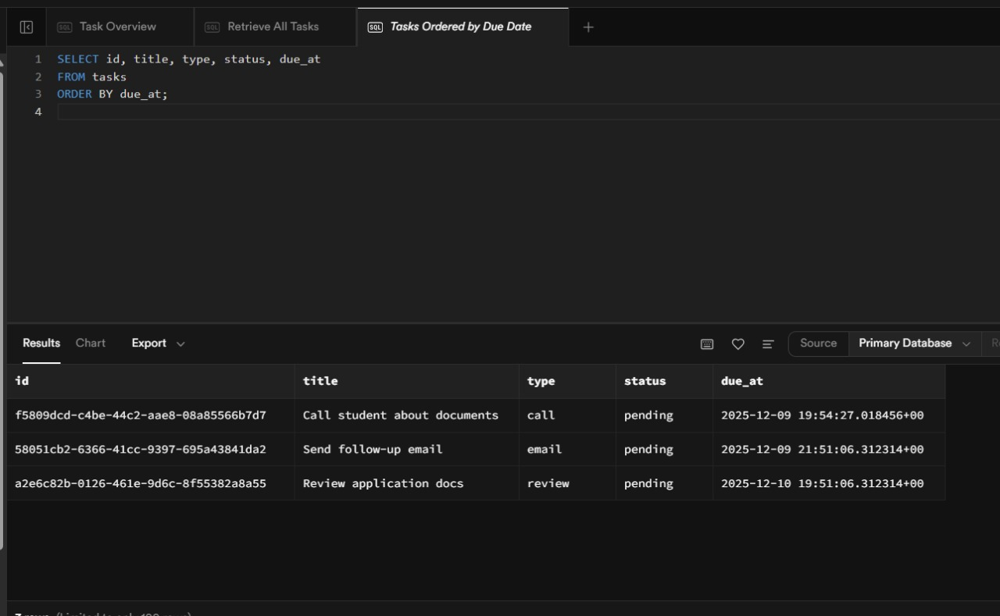

# LearnLynk – Technical Assessment 

Thanks for taking the time to complete this assessment. The goal is to understand how you think about problems and how you structure real project work. This is a small, self-contained exercise that should take around **2–3 hours**. It’s completely fine if you don’t finish everything—just note any assumptions or TODOs.

We use:

- **Supabase Postgres**
- **Supabase Edge Functions (TypeScript)**
- **Next.js + TypeScript**

You may use your own free Supabase project.

---

## Overview

There are four technical tasks:

1. Database schema — `backend/schema.sql`  
2. RLS policies — `backend/rls_policies.sql`  
3. Edge Function — `backend/edge-functions/create-task/index.ts`  
4. Next.js page — `frontend/pages/dashboard/today.tsx`  

There is also a short written question about Stripe in this README.

Feel free to use Supabase/PostgreSQL docs, or any resource you normally use.

---

## Task 1 — Database Schema

File: `backend/schema.sql`

Create the following tables:

- `leads`  
- `applications`  
- `tasks`  

Each table should include standard fields:

```sql
id uuid primary key default gen_random_uuid(),
tenant_id uuid not null,
created_at timestamptz default now(),
updated_at timestamptz default now()
```

Additional requirements:

- `applications.lead_id` → FK to `leads.id`  
- `tasks.application_id` → FK to `applications.id`  
- `tasks.type` should only allow: `call`, `email`, `review`  
- `tasks.due_at >= tasks.created_at`  
- Add reasonable indexes for typical queries:  
  - Leads: `tenant_id`, `owner_id`, `stage`  
  - Applications: `tenant_id`, `lead_id`  
  - Tasks: `tenant_id`, `due_at`, `status`  

---

## Task 2 — Row-Level Security

File: `backend/rls_policies.sql`

We want:

- Counselors can see:
  - Leads they own, or  
  - Leads assigned to any team they belong to  
- Admins can see all leads belonging to their tenant

Assume the existence of:

```
users(id, tenant_id, role)
teams(id, tenant_id)
user_teams(user_id, team_id)
```

JWT contains:

- `user_id`
- `role`
- `tenant_id`

Tasks:

1. Enable RLS on `leads`  
2. Write a **SELECT** policy enforcing the rules above  
3. Write an **INSERT** policy that allows counselors/admins to add leads under their tenant  

---

## Task 3 — Edge Function: create-task

File: `backend/edge-functions/create-task/index.ts`

Write a simple POST endpoint that:

### Input:
```json
{
  "application_id": "uuid",
  "task_type": "call",
  "due_at": "2025-01-01T12:00:00Z"
}
```

### Requirements:
- Validate:
  - `task_type` is `call`, `email`, or `review`
  - `due_at` is a valid *future* timestamp  
- Insert a row into `tasks` using the service role key  
- Return:

```json
{ "success": true, "task_id": "..." }
```

On validation error → return **400**  
On internal errors → return **500**

---

## Task 4 — Frontend Page: `/dashboard/today`

File: `frontend/pages/dashboard/today.tsx`

Build a small page that:

- Fetches tasks due **today** (status ≠ completed)  
- Uses the provided Supabase client  
- Displays:  
  - type  
  - application_id  
  - due_at  
  - status  
- Adds a “Mark Complete” button that updates the task in Supabase  

---

## Task 5 — Stripe Checkout (Written Answer)

Add a section titled:

```
## Stripe Answer
```

Write **8–12 lines** describing how you would implement a Stripe Checkout flow for an application fee, including:

- When you insert a `payment_requests` row  
- When you call Stripe  
- What you store from the checkout session  
- How you handle webhooks  
- How you update the application after payment succeeds  

---

## Submission

1. Push your work to a public GitHub repo.  
2. Add your Stripe answer at the bottom of this file.  
3. Share the link.

Good luck.

## Stripe Answer

I would first create a `payment_requests` table linked to the `applications` table, storing fields such as `application_id`, `amount`, `currency`, `status`, and `stripe_session_id`. When a user clicks **“Pay Application Fee”**, the backend (Next.js API route or Supabase Edge Function) would call `stripe.checkout.sessions.create()` with the payment amount, success and cancel URLs, and the `application_id` in the session metadata. Once Stripe returns the Checkout Session object, I would insert a database record into `payment_requests` with `status = "pending"` and store the returned `stripe_session_id`. The frontend would then redirect the user to `session.url` to complete the payment. A Stripe webhook endpoint would listen for `checkout.session.completed` events and verify the signature. On receiving the event, I would locate the corresponding `payment_requests` record, update its status to `paid`, save any relevant Stripe identifiers such as `payment_intent`, and finally update the related `applications` row (for example, `stage = "fee_paid"`) and append a timeline entry to reflect successful payment completion.

---

## Local Networking Note

During local testing, some browser requests to Supabase intermittently returned DNS resolution errors (`ERR_NAME_NOT_RESOLVED`). This was related to regional ISP/network routing and not application logic. All database operations and Edge Function flows were validated successfully using the Supabase SQL editor and server-side testing.

---

## Screenshots

Verification screenshots from the working Supabase database:

### Tables



### Sample Task Data


